# 🚗 Auto al Piso

Simulador automotriz Full-Stack con reserva de test-drive, simulación de cuotas, catálogo de vehículos y promociones.  
Backend en Node.js/Express, frontend en React/Vite, MongoDB, todo orquestado con Docker y servido vía Nginx.

---

## 🔧 Tecnologías

### Backend  
- Express  
- Mongoose / MongoDB  
- Multer (subida de archivos)  

### Frontend  
- React v18+  
- Vite  
- CSS puro  

### Infraestructura  
- Docker & Docker Compose  
- Nginx (proxy inverso)  
- MongoDB  

---

## 📁 Estructura del Proyecto

```text
.
├── backend
│   ├── controllers
│   ├── models
│   ├── routes
│   ├── server.js
│   └── Dockerfile.dev
├── frontend
│   ├── public
│   ├── src
│   │   ├── components
│   │   └── App.jsx
│   ├── vite.config.js
│   ├── package.json
│   └── Dockerfile.dev
├── nginx
│   └── nginx.conf
├── docker-compose.yml
└── README.md
```

---

## 🚀 Puesta en Marcha

### 🧰 Requisitos Previos
- Docker ≥ 20.10  
- Docker Compose ≥ 1.29

### 1. Clonar el repositorio

```bash
git clone https://github.com/tu-usuario/auto-al-piso.git
cd auto-al-piso
```

### 2. Variables de entorno

Crear un archivo `.env` en la carpeta `backend`:

```ini
MONGO_URI=mongodb://mongo:27017/autosalpiso
PORT=5000
```

### 3. Levantar con Docker

```bash
docker-compose down -v
docker-compose up --build
```

- MongoDB → `mongodb://localhost:27017/autosalpiso`  
- Backend API → `http://localhost/api/...`  
- Frontend SPA → `http://localhost/`

---

## 📸 Capturas del Proyecto

### 🏠 Página principal

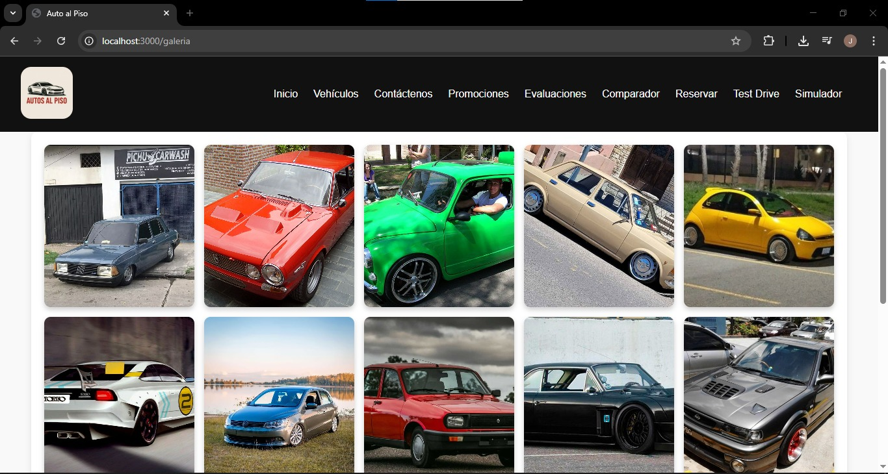

---

### 📷 Galería de vehículos


---

### 📝 Evaluación de vehículos

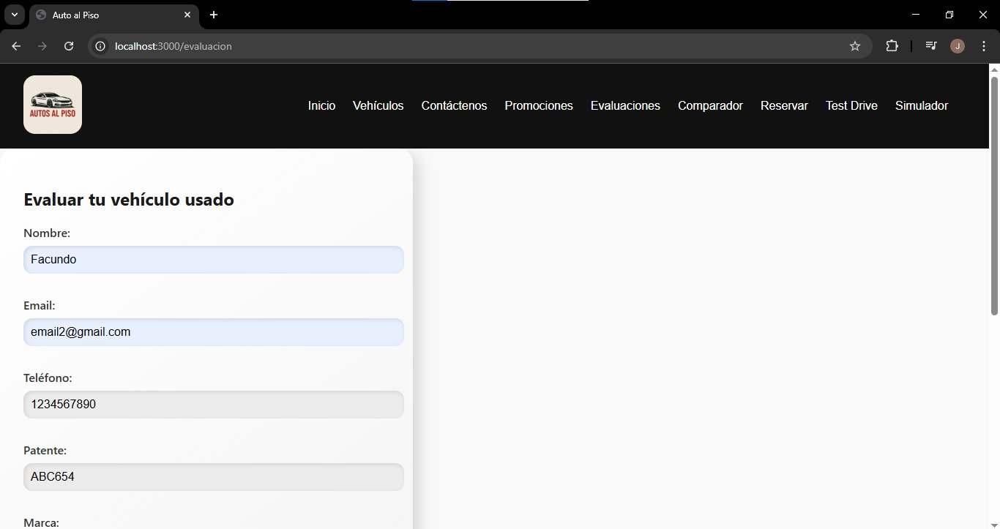  
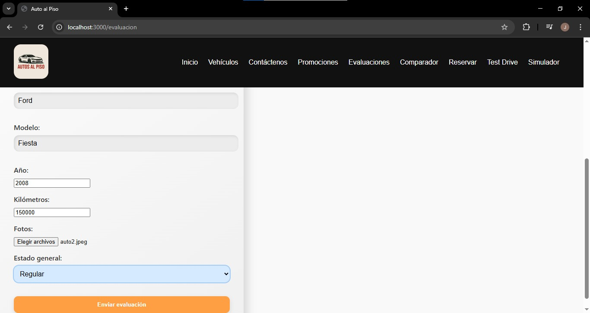

---

### 📊 Vista de evaluaciones

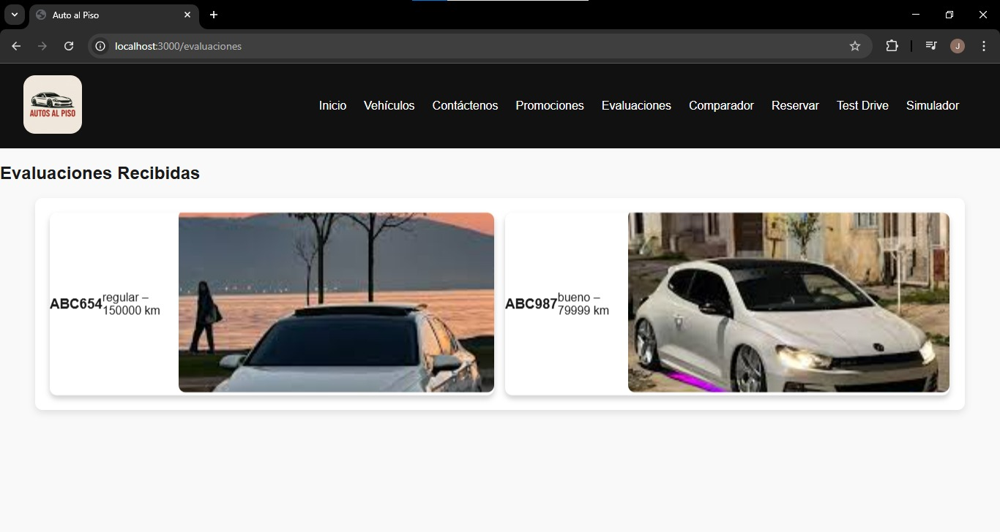

---

### 💰 Simulador de financiación

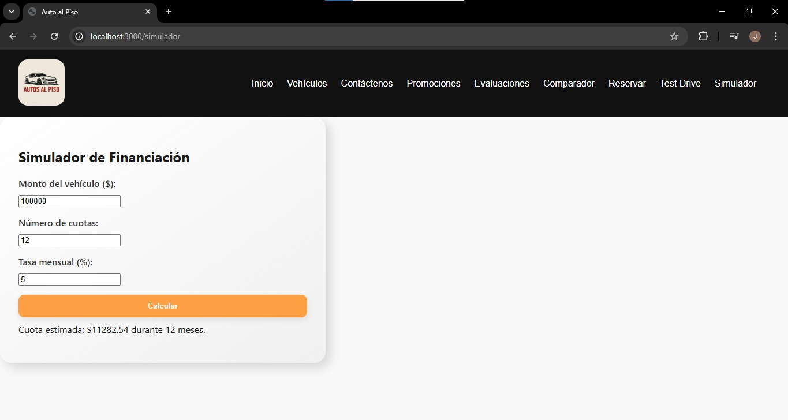

---

### 🔍 Comparador de vehículos

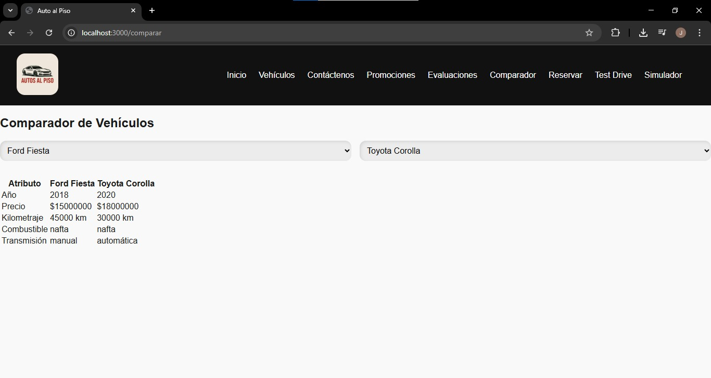

---

### 🎉 Promociones activas

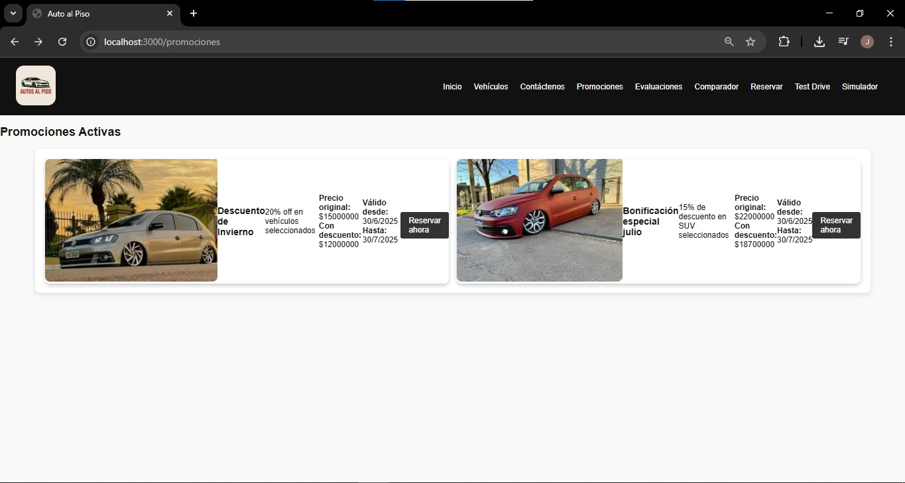

---

### 📅 Reserva desde promociones

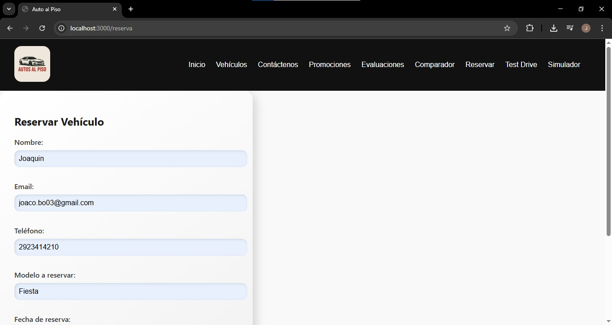

---

### 📆 Formulario de reserva

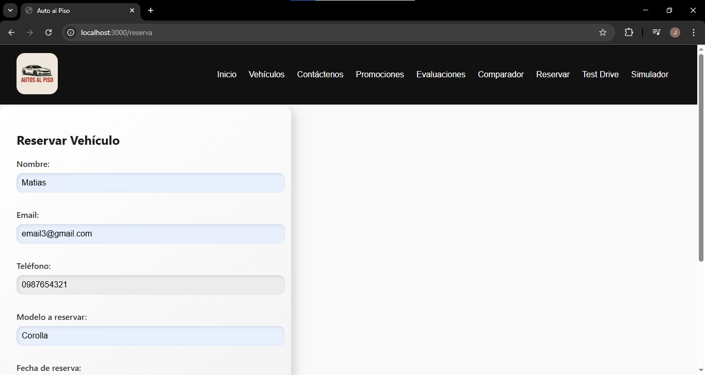  
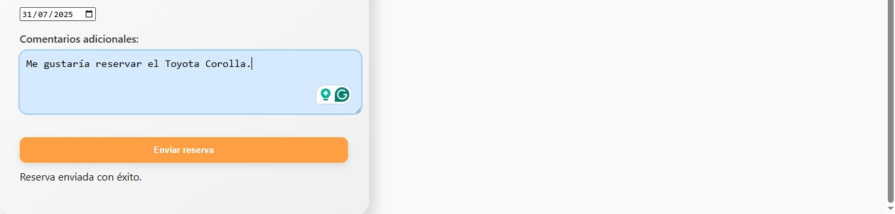

---

### 📋 Vista de reservas

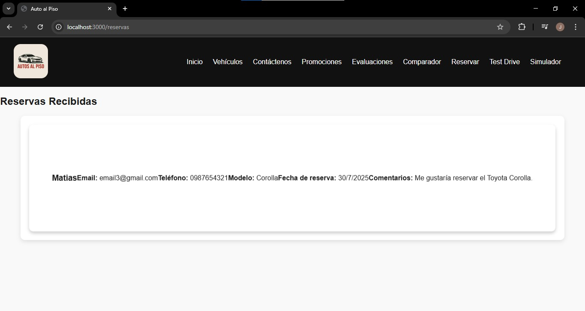

---

### 🚘 Test Drive

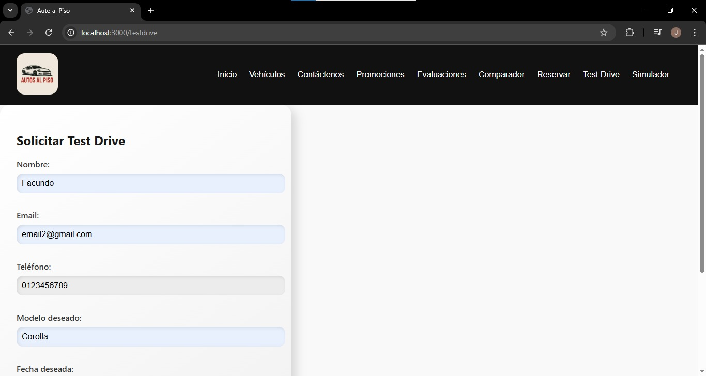  
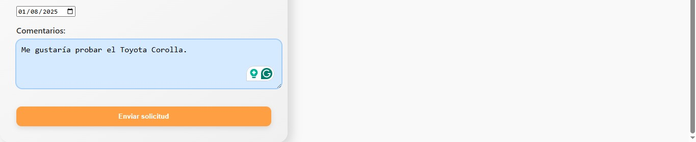

---

### 📞 Contacto y mapa

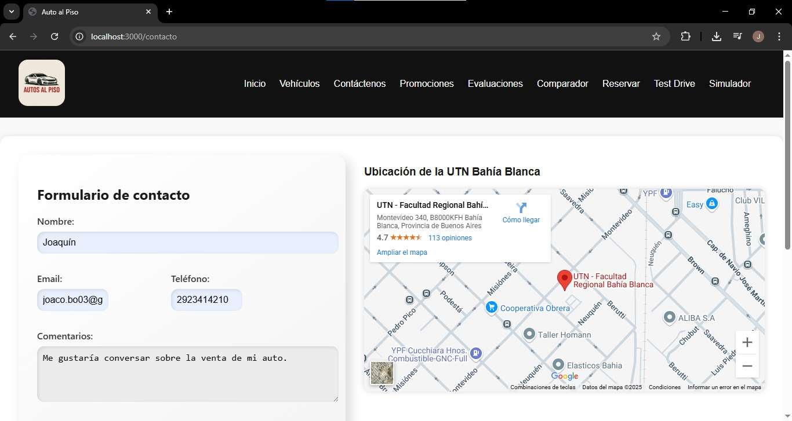  
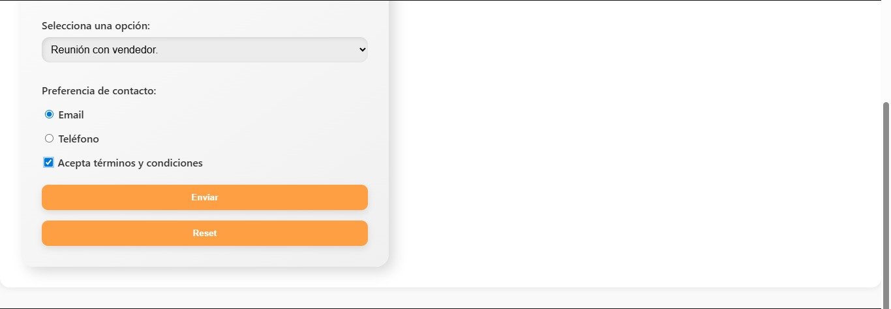

---

### 💬 Chatbot flotante

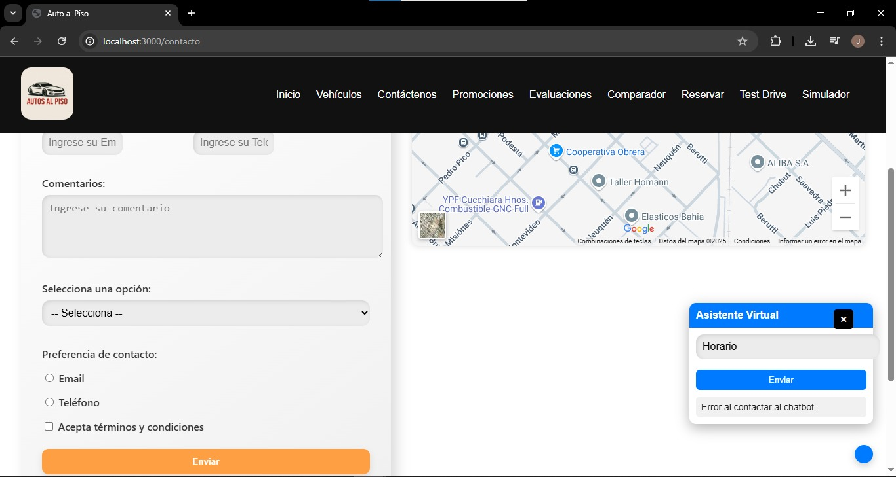

---

## 🧪 CRUD de Vehículos (Postman)

### ✅ POST

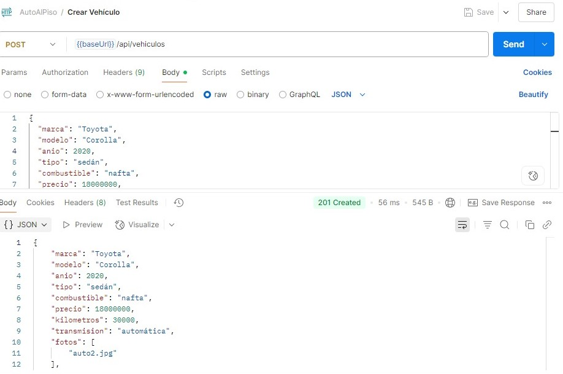

### ✅ GET

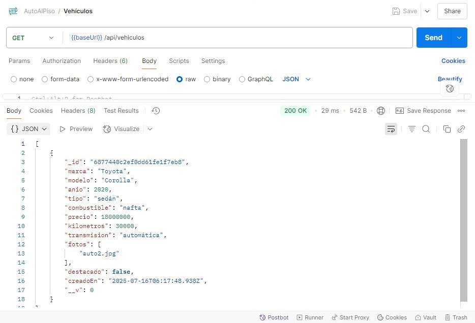

### ✅ PUT

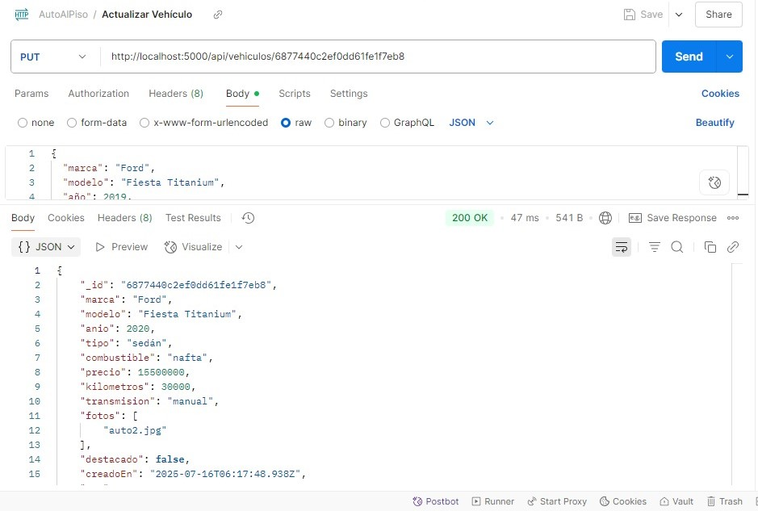

### ✅ DELETE

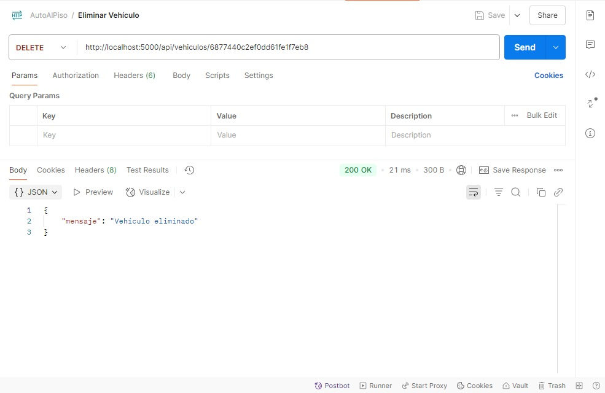

---

## 📜 Endpoints Principales

| Método | Ruta | Descripción |
|--------|------|-------------|
| GET    | /api/vehiculos                     | Listar todos los vehículos |
| POST   | /api/vehiculos                     | Crear un nuevo vehículo |
| GET    | /api/testdrive                     | Listar turnos de test-drive |
| POST   | /api/testdrive                     | Agendar un test-drive |
| GET    | /api/evaluacion                    | Listar evaluaciones |
| POST   | /api/evaluacion                    | Crear evaluación con fotos (multipart) |
| POST   | /api/chatbot                       | Consultar asistente virtual |
| GET    | /api/promociones                   | Listar promociones |
| POST   | /api/promociones                   | Crear una promoción |
| POST   | /api/financiamiento/simular        | Simular plan de financiamiento |
| GET    | /api/reservas                      | Listar reservas |
| POST   | /api/reservas                      | Crear una reserva |

---

## 🌐 Rutas de Frontend

| Ruta              | Componente   | Descripción                        |
|-------------------|--------------|------------------------------------|
| `/`               | Home         | Página principal                   |
| `/galeria`        | Galería      | Listado de vehículos               |
| `/evaluaciones`   | Evaluaciones | Ver evaluaciones de autos          |
| `/reservas`       | Reservas     | Ver y crear reservas               |
| `/promociones`    | Promociones  | Listado de promociones             |
| `/contacto`       | Contacto     | Formulario de contacto             |
| `/simulador`      | Simulador    | Cálculo de cuotas                  |
| `/comparar`       | Comparador   | Comparación entre vehículos        |

---

## 🎯 Mejoras Futuras

- Autenticación y roles (admin/cliente)
- Paginación y filtros en listados
- Validación avanzada y notificaciones por email/WhatsApp
- Animaciones, transiciones y diseño responsivo
- Deploy a un entorno en la nube (AWS, DigitalOcean)

---

## 🤝 Contribuciones

1. Haz un **fork**
2. Crea una rama:
   ```bash
   git checkout -b feature/mi-mejora
   ```
3. Haz commit y push:
   ```bash
   git push origin feature/mi-mejora
   ```
4. Abre un **Pull Request**

---

📌 Proyecto con fines educativos — “**Auto al Piso**” 🚗
